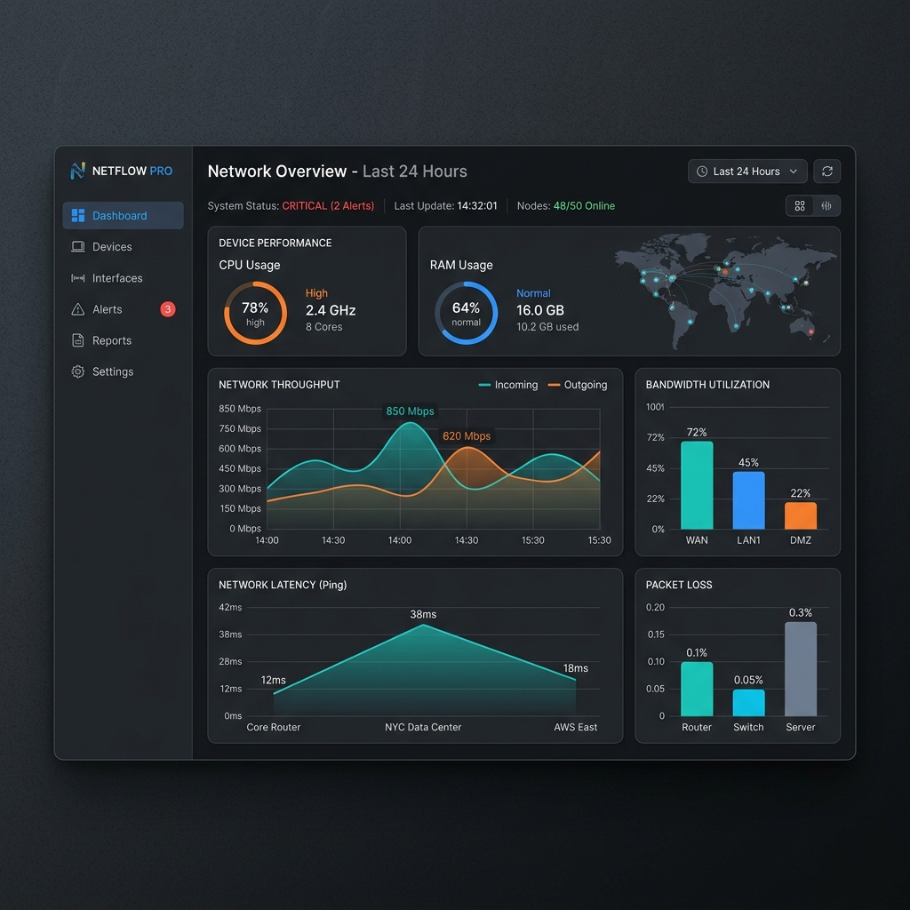
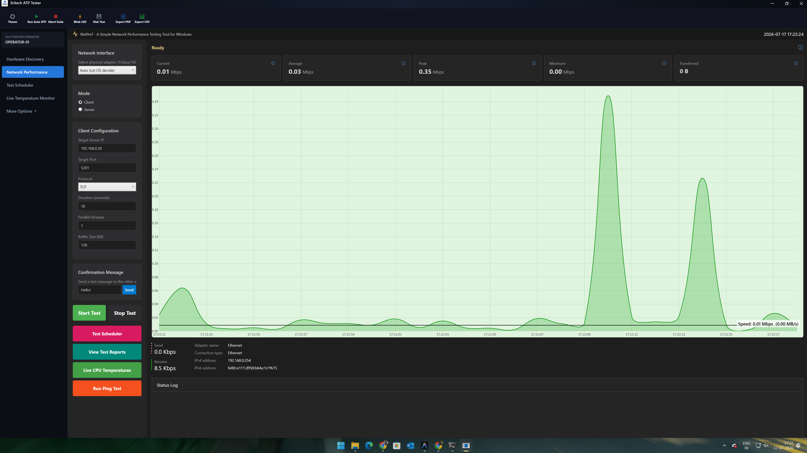
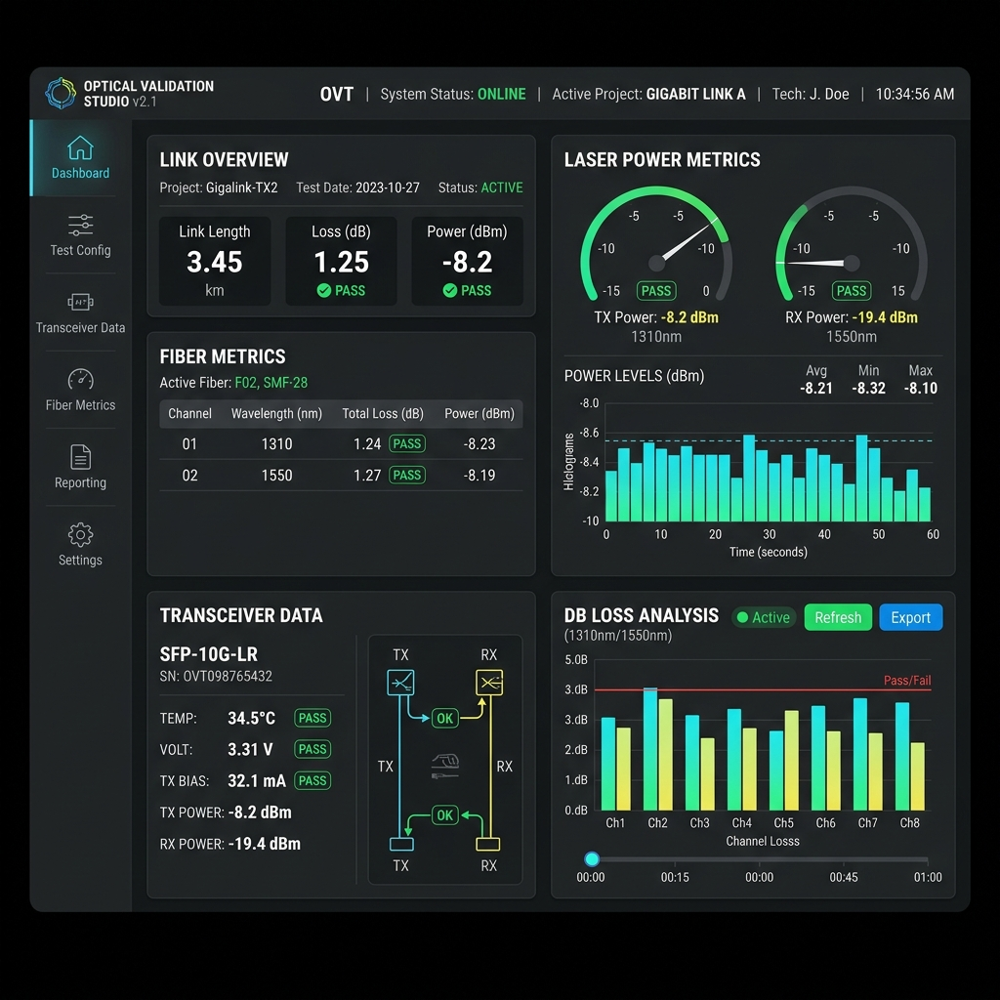
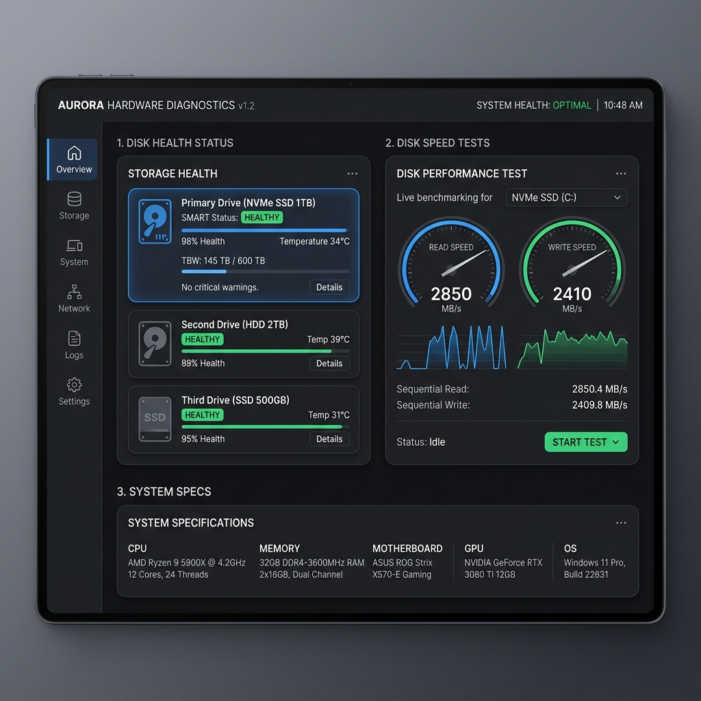

# ATP Enterprise

ATP (Acceptance Test Procedure) Enterprise is a comprehensive WPF (Windows Presentation Foundation) desktop application built in C#. It is designed for hardware diagnostics, network performance evaluation, and system validation.

## Features

- **Dashboard & Monitoring**: Real-time overview of system health and metrics.
- **Network Performance Testing**: Advanced network diagnostics including throughput testing, ethernet, and fiber optic interface validation.
- **Hardware Diagnostics**: System information gathering and storage speed/health testing.
- **Optical Validation**: Specialized testing for optical modules and interfaces.
- **Test Automation & Execution**: Automated procedure loading, scheduling, and execution engine.
- **Traceability & Reporting**: Comprehensive test logging, traceability database integration, and automated report generation.

## Screenshots

*(Please replace these placeholder images with actual screenshots of your application)*

| Dashboard | Network Performance |
| :---: | :---: |
|  |  |
| **Optical Validation** | **Hardware Diagnostics** |
|  |  |

## Project Structure

- **Models/**: Core data structures representing tests, equipment, logs, and system metrics.
- **Views/**: WPF XAML UI components (Dashboard, NetworkPerformance, StorageTests, OpticalTest, etc.).
- **Services/**: Background engines and utilities handling the core logic (TestExecutionEngine, NetPerfEngine, DiskSpeedTestService, ReportService).
- **Converters/**: UI value converters for data binding in XAML.

## Getting Started

### Prerequisites
- Windows OS
- .NET Framework / .NET Core (depending on your configuration)
- Visual Studio or any compatible C# IDE

### Installation & Run
1. Clone the repository:
   ```bash
   git clone https://github.com/PRASANNABABU25/ATP-Enterprise-Source.git
   ```
2. Open `atp-enterprise-app-wpf.csproj` in Visual Studio.
3. Restore any NuGet packages if required.
4. Build and Run the application.

## Contributing

1. Fork the project.
2. Create a new feature branch (`git checkout -b feature/AmazingFeature`).
3. Commit your changes (`git commit -m 'Add some AmazingFeature'`).
4. Push to the branch (`git push origin feature/AmazingFeature`).
5. Open a Pull Request.

## License

This project is licensed under the MIT License - see the LICENSE file for details.
